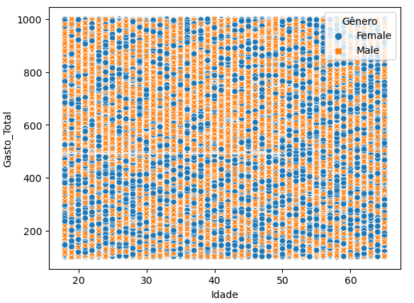
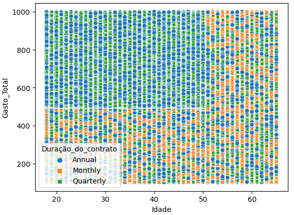
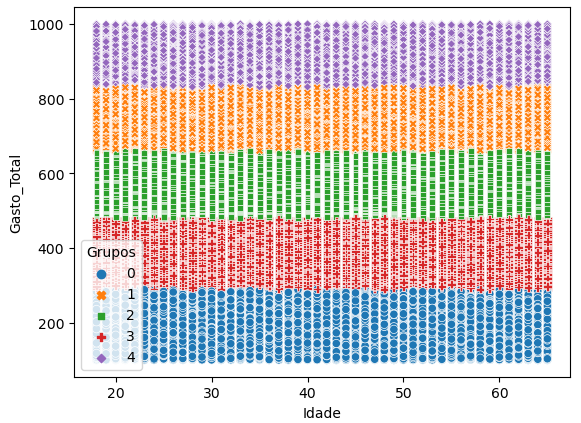

# Agrupamento de clientes com-Marchine-Learning

# 1. Introdução
O agrupamento de clientes consiste é uma técnica que visa dividir o consumidores de determinada empresa em grupos específicos, os quais compartilham características em comuns, tais como desejos, hábitos, renda, gostos, dentre outros. Assim, é possível entender o perfil de consumo dos clientes e direcionar melhor as vendas.  Desse modo, a partir do conjunto de dados extraidos da plataforma [Kaggle](https://www.kaggle.com/datasets/muhammadshahidazeem/customer-churn-dataset), este projeto tem a finalidade de agrupar os clientes com base nos atributos/características fornecidas pela base de dados.

# 2. Objetivo
O objetivo desse projeto é a aplicação de algoritmos de agrupamento com a finalidade de agrupar os clientes com base nos atributos/características fornecidas pela base de dados.

# 3. Justificativa
O agrupamento de clientes permite entender o perfil de cada um deles e, com isso, direcionar melhor as vendas, constribuido para o aumento de receitas.

# 4. Metodologia  
Este é um projeto de data sciense and analyts, que envolve a utilização de modelos de machine leaning com objetivo de agrupar os clientes com base nos atributos/características fornecidas pela base de dados. É um projeto feito em python utilizando as bibliotecas do mesmo. Sendo assim, para alcançar o objetivo proposto, o primeiro passo é importar as bibliotecas do python necessárias  para construção do projeto. Em seguida, é feita a coleta dos dados. Logo após, uma análise dos dados inicial, com intuito de conhecer os dados e verificar possíveis inconsistências, tais como valores faltantes, valores inconsistentes, valores duplicados, presença de outliets, dentre outros. Depois, é feito a limpeza e o tratamento dos dados. Em seguida é realizado análise exploratória dos dados, com a finalidade de obter insigts para o time de negócios. Depois é feita a aplicação dos algoritmos de agrupamento. Esse projeto se baseia um pouco no modelo Cross-Industry Standard Process for Data Mining (CRISP-DM), que é uma técnica que visa trabalhar em ciclos, fazendo com que possamos mapear e solucionar os problemas que possam existir no projeto. Desse modo, o projeto foi dividido da seguinte maneira:
#### 1. Introdução (Entendimento do Negócio)
- Tem por objetivo identifiar as demandas do time de negócio   
#### 2. Objetivo
- A partir da idenrificação das demandas do time de negócios traçar o objetivo do projeto.
#### 3. Justificativa
- O porque da realização do projeto.
#### 4. Metodologia
- Como será feito
#### 5.  Importação das bibliotecas utilizadas ao longo de todo o projeto
- Quais bibliotecas necessárias para rodar o projeto em python
#### 6.  Coleta de dados
- Onde se encontra os dados
#### 7. Verificando inconsistências nos dados
- Como os dados se apresentam
#### 8. Limpeza e Tratamento dos Dados
- Deixando os dados limpos 
#### 9. Análise Exploratória dos Dados: Obtendo insigts para o time de negócios
- Analisando o comportamento das variáveis para obter insigts time de negócios.
#### 10. Aplicando os algoritmos de Agrupamento
- Aplicação dos algoritmos de agrupamento.
#### 11. Traduzindo desempenho dos modelos escolhidos para métricas de negócios
- Traduzir o desempenho do modelo para métricas de negócios.

# 5. Coleta dos dados

Os dados foram extraidos da plataforma [Kaggle](https://www.kaggle.com/datasets/muhammadshahidazeem/customer-churn-dataset) Foi feio o downloard do arquivo em csv e importado para o jupyter notebook utilizando a biblioteca pandas. Após isso, foi feito um cópia desses dados.

# 6. Verificando inconsistências nos dados

## - Tamanhos dos dados
O conjunto de dados possui 440833 linhas e 12 colunas.
## - Tipo dos dados

## - Verificando existência de valores nulos

Todas as colunas possui 1 valor nulo. Cada valor nulo de cada coluna representa 0.000227% da mesma.
## - Verificando existência de valores inconsistentes
Não há valores inconsistentes na base de dados.
## - Verificando a existência de dados duplicados
Não há valores duplicados.
## - Conclusões
Foi dentificado os seguintes problemas:
* Em todas as colunas há um valor nulo.

# 7. Limpeza e Tratamento dos Dados

## - Tratando os valores faltantes
Foi feita a exclusão dos valores faltantes.
## - Detecção de outliers  com o Boxplot
 
## - Detecção de outliers com o algoritmo KNN
- Lista completa dos outliers para ser enviada para o setor responsável

# 8. Análise Exploratória dos Dados: Obtendo insigts para o time de negócios
## 8.1 Hipótese de Negócios
- Mapa Mental de Hipóteses

#### - Lista de Hipóteses:
   
**1**. Clientes mais novos tendem a cancelar os serviços em comparação com os clientes mais velhos.

**2**. Mulheres tendem a cancelar os serviços mais do que os homens.

**3**. Clientes que utilizam os serviços por mais tempo dificilmente cancelam.

**4**. Clientes com maior número de chamadas de suporte tendem a cancelar os serviços.

**5**. Clientes com maior número de atraso no pagamento tendem a cancelar os serviços.

**6**. Clientes com assinaturas básicas tendem a cancelar os serviços.

**7**. Clientes cuja duração do contrato é de um mês tendem a não prosseguir com os serviços.

**8**. Clientes que interagem menos tem a tendência de cancelar os serviços.

## 8.2  Análise Univariada
### 8.2.1 Distribuição da variável resposta
### -  Plotando um gráfico de distribuição normal

### - Executando o teste de Shapiro-Wilk para ver se a distribuição está normal

### 8.2.2 Separando as variáveis categóricas e númericas
#### - Variáveis númericas

#### - Variáveis categóricas

### 8.2.3 Analisando os atributos númericos
### -  Estatísticas Descritivas

### -  Distribuição das variáveis numéricas

## 8.3 Análise Bivariada - Validação de Hipóteses
### - H1: Clientes mais novos tendem a cancelar os serviços em comparação com os clientes mais velhos.
                                                    Quantidade de Churn por Idade

**FALSO**: Assumindo 0.0 (cancelou) 1.0 (não cancelou), os clientes mais velhos, a partir de 51 anos, cancelaram os serviços. Já clientes entre 30 e 50 anos não cancelaram. A maioria dos clientes entre 18 e 29 anos cancelaram os serviços.

### - H2: Mulheres tendem a cancelar os serviços mais do que os homens.
                                                    Quantidade de churn de acordo com o Gênero

**FALSO**: Assumindo 0.0 (cancelou) 1.0 (não cancelou), existem mais homens do que mulheres que cancelaram o serviço. Em contrapartida, existe mais mulheres do que homens que não cancelaram os serviços, embora com uma distância pequena. Com base nisso, é necessário entender os motivos que levaram mais pessoas do sexo masculino a cancelar os serviços e tomar medidas como forma de reter essas pessoas do sexo masculino.

### - H3: Clientes que utilizam os serviços por mais tempo dificilmente cancelam.
                                                   Quantidade de Churn por Frequência de uso

**FALSO**: Assumindo 0.0 (cancelou) 1.0 (não cancelou), dentre os clientes que possui maior frequência, a maioria cancelaram. Inclusive, em todas as frequência de uso que aparecem no gráfico, o número de clientes que cancelaram o serviço é maior do que o número de clientes que não cancelaram. Sendo assim, é necessário entender porque o número de cancelamentos é maior em todas as frequências de uso e tomar as medidas necessárias para contornar tal situação.

### - H4: Clientes com maior número de chamadas de suporte tendem a cancelar os serviços.
                                                Quantidade e Churn por Chamadas de suporte

**FALSO**: Assumindo 0.0 (cancelou) 1.0 (não cancelou), conforme o gráfico, dentre os clientes que possui maior número de suporte, isto é, número de chamada de suporte a partir de 6.0, não houve cancelamento.

### - H5: Clientes com maior número de atraso no pagamento tendem a cancelar os serviços.
                                              Quantidade de Churn por Atraso de pagamento

**FALSO**: Assumindo 0.0 (cancelou) 1.0 (não cancelou), não necessariamente, pois perceba pelo gráfico que os clientes com 21 atrasos em diante não cancelaram o serviço.

### - H6: Clientes com assinaturas básicas tendem a cancelar os serviços.
                                              Quantidade de Churn por Tipo de assinatura

**FALSO**: Assumindo 0.0 (cancelou) 1.0 (não cancelou), dentre os clientes que possuem assinaturas básicas, a maioria não cancelaram o serviço. O mesmo ocorre com clientes que possuem assinatura padrão e assinatura primium.

### - H7: Clientes cuja duração do contrato é de um mês tendem a não prosseguir com os serviços.
                                               Quantidade de Churn em relação a Duração do contrato

**FALSO**: Assumindo 0.0 (cancelou) 1.0 (não cancelou), dentre os clientes existentes na base de dados, todos que possuem contrato de um mês não cancelaram o serviço.

### - H8: Clientes que interagem menos tem a tendência de cancelar os serviços.
                                      Quantidade Churn por Última_interação

**VERDADEIRO**: Assumindo 0.0 (cancelou) 1.0 (não cancelou), conforme o gráfico, clientes cuja última interação vai de 1.0 a 15.0 cancelaram o serviço. Contudo, praticamente a mesma quantidade de clintes com essa mesma interação não cancelaram.

## 8.4 Análise Multivariada
### - Atributos numéricos

### - Correlação entre as variáveis númericas

### -  Atributos categóricos

### -  Correlação entre as variáveis categóricas

# 10. Aplicando os algoritmos de Agrupamento
**Algoritmos utilizados**

**1**. K-means

**2**. Agrupamento hierárquico

**3**. DBSCAN

## 10.1 K-means
### 10.1.1 Agrupando Gasto Total por Idade

*  No eixo x temos a idade (quanto mais para a direita maior a idade) e no eixo y temos o gasto total (quanto mais na parte superior/cima do gráfico maior é o gasto total do cliente).

* Por exemplo, esse grupo azul que é o grupo 0 são as pessoas mais jovens e que os gastos são menores.

* O grupo amarelo são pessoas mais velhas com gastos menores.

* O grupo roxo são pessoas jovens e com gastos maiores.

* O grupo laranja são pessoas mais velhas com gastos maiores.

* Para essas pessoas que tem gastos menores, é interessante buscar compreender melhor seu perfil de compra e direcionar as vendas para elas de acordo com esse perfil, assim pode ser que elas compram mais e seu gasto aumente.

### 10.1.2 Agrupamento com mais atributos
* Utilizando a mesma base anterior, porém anteriormente utilizamos somente os idade e o gasto total. Porém, quanndo trabalhamos com essa área de agrupamento em aplicações comerciais é bem comum utilizar o agrupamento com todos os atributos disponíveis na base de dados ou com os atributos que são de interesse da empresa.

* Neste caso não podemos fazer a mesma análise que anterior, isto é, de falar que no eixo x temos a idade e no eixo y o gasto total, pois neste caso temos 2 novos atributos que foram gerados por meio dos atributos já existentes. Então a análise acaba ficando mais complexa e é interessante mais pela visualização de resultados.

## 10.2 Agrupamento hierárquico
## 10.3 DBSCAN
* Não conseguir fazer a aplicação do agrupamento hieráquico e do DBSCAN nem pelo jupyter notebook na minha máquina nem no google colab devido a insuficiência de memória necessária a aplicação desse algoritmo. 

## 10.4 K-means x Hierárquico x DBSCAN

## 10.5 Testando agrupamento com algumas colunas entre si
### 10.5.1 Gasto Total por Idade de acordo com o Gênero

### 10.5.2 Gasto Total por Idade de acordo com o Tipo_de_assinatura

### 10.5.3 Gasto Total por Idade de acordo com a Duração_do-contrato

### 10.5.4 Gasto total e Última interação por idade

### 10.5.5 Agrupando Gasto Total e Idade em cinco Grupos

# 11. Tradução dos resultados para métricas de negócios
* O objetivo do agrupamento neste projeto foi agrupar os clientes com base nos atributos/características fornecidas pela base de dados.

* Com isso, é possível entender o perfil de cada um dos clientes e, assim, direcionar melhor as vendas, constribuido para o aumento de receitas.

* Nesse sentido, uma vez feita o agrupamento dos clientes acima de acordo com algumas características é possível entender melhor o perfil dos clientes, e com a lista desses clientes traçar algumas medidas, seja de fidelização ou de atração o que pode trazer ganhos de receitas, aumentando assim o lucro.
